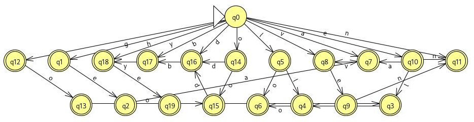
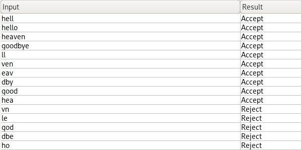
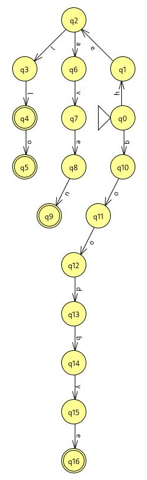
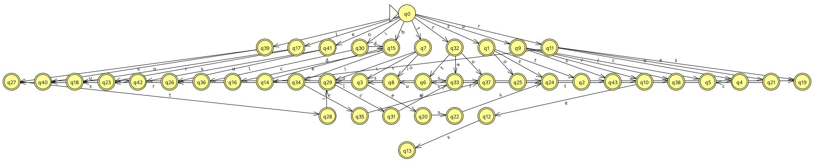
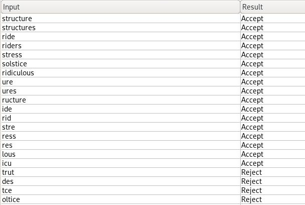
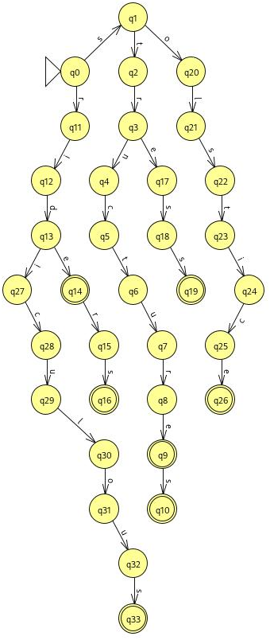

## Exemplos de aceitação

### Cenário: hello, heaven, goodbye, ...

#### Sufixo (aceita fatores)

#### Aceitação

#### Trie

### Cenário: structure, ride, stress, ...

#### Sufixo (aceita fatores)

#### Aceitação

#### Trie

